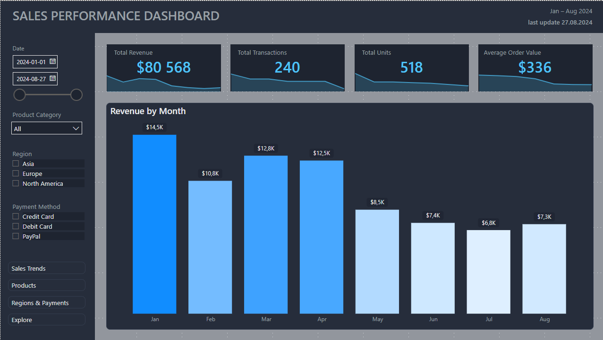
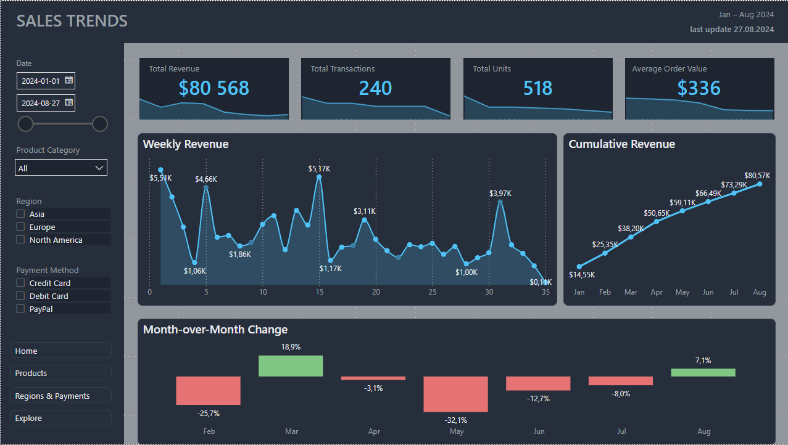
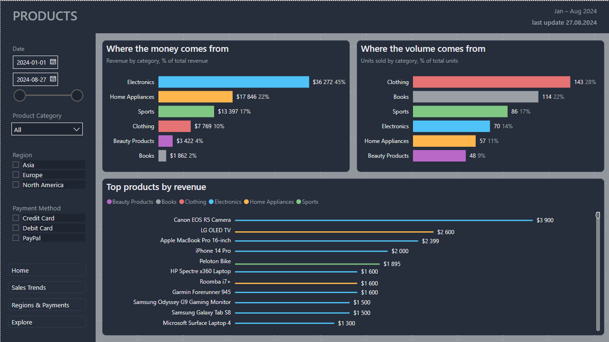
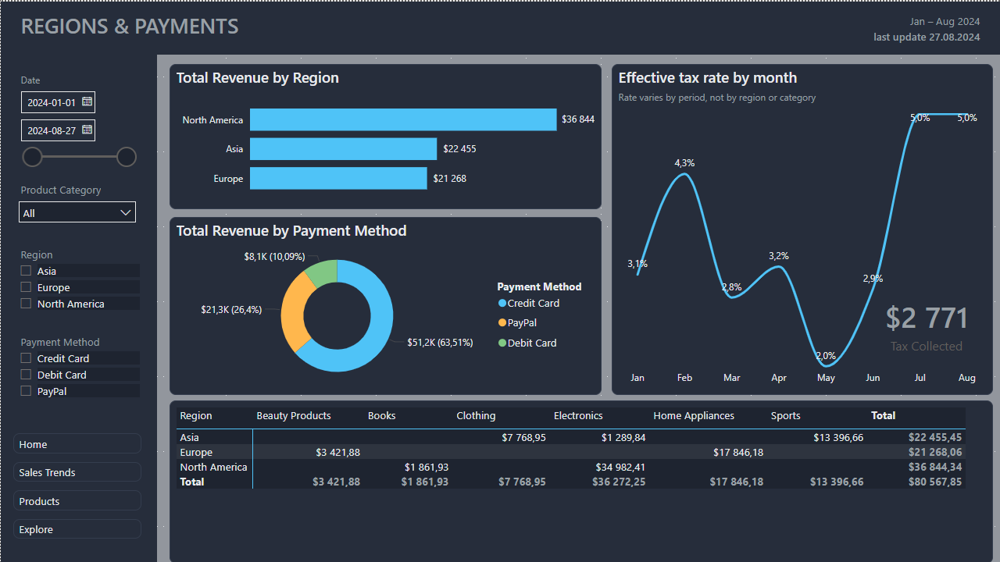
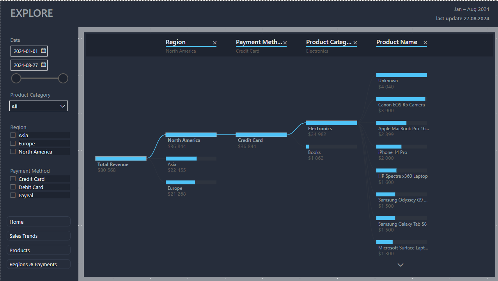

# Sales Performance Dashboard — Power BI

Interactive multi-page Power BI report analysing an online retail transactions dataset
(Jan–Aug 2024, 240 transactions). Built as the final project for the GoIT Data Analytics course.

The report covers the full pipeline: raw-data profiling and cleaning in Power Query,
data modelling (star schema with a dedicated date table), DAX measures, and a five-page
interactive dashboard with a consistent dark theme, cross-page slicers, page navigation,
report-page tooltips and a Decomposition Tree.

---

## Contents

- [Overview](#overview)
- [Dataset](#dataset)
- [Data cleaning](#data-cleaning)
- [Data model](#data-model)
- [Dashboard pages](#dashboard-pages)
- [Key insights](#key-insights)
- [Data quality notes & limitations](#data-quality-notes--limitations)
- [Tools](#tools)
- [How to open](#how-to-open)

---

## Overview

The dashboard answers four questions, one per page:

1. **How is the business doing overall?** — headline KPIs + revenue trend (Home)
2. **How did sales change over time?** — weekly revenue, cumulative revenue, month-over-month change (Sales Trends)
3. **What do we sell and what makes money?** — revenue vs. volume by category, top products (Products)
4. **Where and how do customers buy — and how much goes to tax?** — region, payment method, tax (Regions & Payments)

A fifth page (Explore) provides a Decomposition Tree for free-form drill-down.

The design principle throughout: **one page = one question**, consistent grid, colours locked
to categories across all pages, and every metric shown with context (trend or share of total)
rather than as an isolated number.

---

## Dataset

Synthetic online-sales dataset provided by the course. 240 transactions, 10 columns:
Transaction ID, Date, Product Category, Product Name, Units Sold, Unit Price, Total Revenue,
Tax%, Region, Payment Method.

The data was intentionally "dirty" — the cleaning below is the core analytical work of the project.

---

## Data cleaning

All cleaning was done in **Power Query** (the assessed part of the task). A parallel **pandas**
audit was used to independently find anomalies and cross-check the Power Query result.

### 1. Corrupted `Units Sold` — recovered, not guessed
Some values were fractional (e.g. `3.2`, `4.001`) — impossible for physical units.
Crucially, the true value could be **verified** rather than rounded blindly: since
`Total Revenue = round(Units Sold) × Unit Price`, dividing revenue by price recovers the
correct integer (e.g. `209.97 / 69.99 = 3`, so `3.2 → 3`).

### 2. Locale issue in `Unit Price`
`Unit Price` used a comma as the decimal separator (`999,99`) while `Total Revenue` used a period
(`1999.98`), so the column imported as text. Fixed by explicit type conversion using locale,
handling the mixed formatting safely.

### 3. Impossible tax rate — 222%
`Tax%` value_counts revealed **24 rows with a rate of 222%**, plus 18 genuine nulls — 42 corrupted
rows in total (7.5% of the column). The `222` values were replaced with null first (so they
wouldn't poison any fill/average), then all 42 gaps were filled.

**How the gaps were filled — an analytical decision:** a cross-tab showed the tax rate does **not**
depend on Region (evenly spread) but is tied to **time periods** — it holds constant over stretches
of dates and switches on specific dates (2% → 3% → 4% → 5% across the year). Gaps were therefore
filled chronologically (sort by date → Fill Down → Fill Up), inheriting the rate of the surrounding
period, rather than with a global mode. This is documented on the Regions & Payments page, where the
"Effective tax rate by month" chart visually confirms the step pattern.

### 4. Missing categories — recovered from product name
A few rows had a blank `Product Category` but a known `Product Name`
(e.g. Columbia Fleece Jacket → Clothing).

### 5. Inconsistent categorisation — found via the dashboard
Two products appeared under **two different categories** in different transactions:
**Garmin Forerunner 945** (Electronics / Sports) and **Dyson Supersonic Hair Dryer**
(Beauty / Home Appliances). These are genuine data inconsistencies (borderline products that
legitimately belong to two "worlds"). Since category-level analytics require one category per
product, each was normalised to a single category (Garmin → Electronics, Dyson → Home Appliances).
The Garmin rows also had two different unit prices — an additional symptom of data-entry quality.

### 6. Missing product names
5 transactions had no product name (filled as "Unknown"). They are kept in category-level analysis
(they carry real revenue in a real category) but **excluded from the product-level ranking**, where
they otherwise collapsed into one fake bestseller.

---

## Data model

- **Star schema**: `sales_transactions` (fact) + `Calendar` (date dimension), joined 1-to-many on Date.
- **Calendar** built as a DAX calculated table with `CALENDAR(MIN, MAX)` and English month names
  (`FORMAT([Date], "MMMM", "en-US")`), marked as a date table; month columns sorted by month number.
- **Measures** organised in a dedicated measures table. Key ones:
  `Total Revenue`, `Total Transactions`, `Total Units`, `Average Order Value`,
  `Tax Collected` (SUMX), `Revenue % of Total` / `Units % of Total` (ALLSELECTED),
  `Revenue MoM %` (DATEADD), `Revenue Running Total`, `Effective Tax Rate`.

---

## Dashboard pages

### 1 · Home
Executive summary: four KPI cards (each with a sparkline), a "Revenue by Month" column chart, and the
filter panel + navigation shared across all pages.

### 2 · Sales Trends
Time analysis: weekly revenue (smoothed line, ~35 points), cumulative revenue, and a month-over-month
change chart with conditional colouring (green = growth, red = decline).

### 3 · Products
The core insight of the dataset. Two mirrored bars — "Where the money comes from" (revenue by category)
vs. "Where the volume comes from" (units by category) — plus a top-products ranking. Bars are coloured
by category consistently, so the reversal of order between the two charts is immediately visible.

### 4 · Regions & Payments
Region revenue, payment-method donut, a Region × Category matrix, and the tax block
(Tax Collected card + Effective-tax-rate-by-month chart proving the period-based rate pattern).

### 5 · Explore
Decomposition Tree for free-form drill-down: Total Revenue → Region → Payment Method → Category → Product.

**Interactivity:** cross-page synced slicers (Date, Category, Region, Payment Method), page navigation
on every page, and **report-page tooltips** — hovering a bar reveals a mini-chart breaking that value
down further.

---

## Key insights

- **Money and volume come from different categories.** Electronics drives **44% of revenue** but only
  **13% of units** (average price ≈ $517); Clothing is the opposite — **28% of units, 10% of revenue**
  (≈ $54). Optimising by "units sold" would point to the wrong products. Average unit price ranges
  ~32× across categories ($16 for Books to $517 for Electronics).

- **Payment is concentrated:** Credit Card accounts for **~63%** of all revenue.

- **The tax rate is time-based, not regional** — it changes in periods across the year (2–5%),
  which is why the missing values were filled chronologically rather than by group.

- **Revenue is lumpy, driven by a few large deals.** Electronics has only ~5 transactions/month;
  its monthly revenue swings sharply (two peaks, not a smooth trend), so overall business revenue
  is sensitive to a handful of high-value orders.

---

## Data quality notes & limitations

The dataset is **synthetic**, and two structural artifacts are worth stating honestly:

- **Region and Category are near-collinear.** The Region × Category matrix shows each region sells only
  2–3 categories, with almost no overlap (Electronics ≈ North America only, Home Appliances = Europe only,
  Sports = Asia only). "Regional differences" here are therefore an artifact of data generation, **not**
  a finding about customer behaviour. The regional view is kept in the report but should not be read as
  market analytics.

- **Tax is sales tax charged on top of revenue** — it's pass-through to the government, not business
  profit, so it is treated as a secondary metric.

Because there is no customer ID or basket data, questions like "does Clothing (a high-traffic,
low-revenue category) pull other purchases along?" cannot be answered from this data — a limitation
stated rather than guessed around.

---

## Tools

Power BI Desktop · Power Query (M) · DAX · pandas (audit & cross-check) · Excel

---

## How to open

1. Download `Sales transactions.pbix` and open it in **Power BI Desktop**.
2. `GO_IT_cleaned_by_pandas.xlsx` contains the cleaned dataset (reference output of the cleaning pipeline).
3. In Desktop, buttons require **Ctrl + click**;
